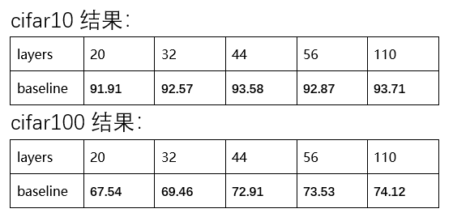
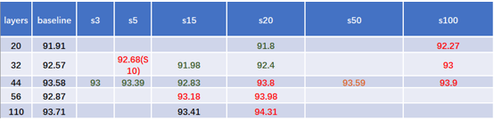
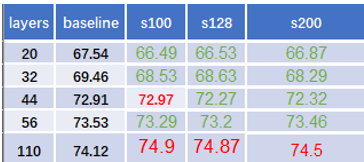
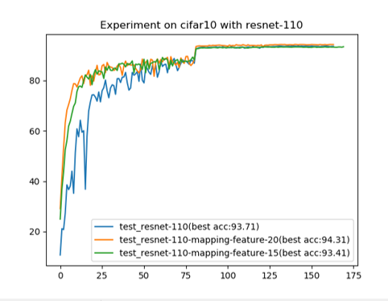
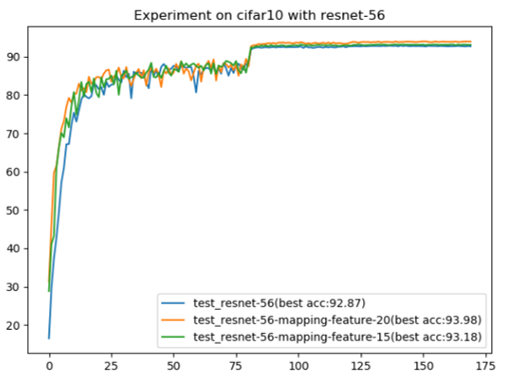
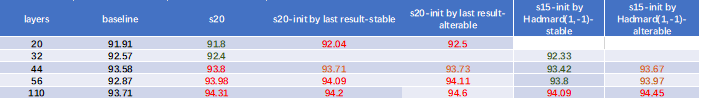
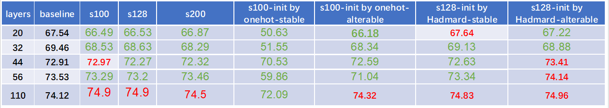
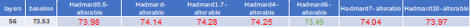
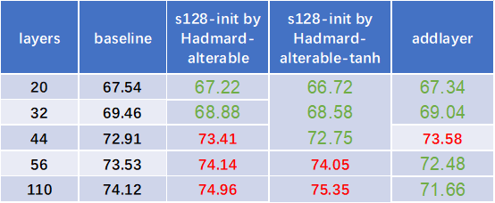
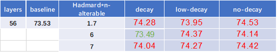

# LabelMapping

### restnet-20\32\44\56\110 cifar10/cifar100 origin
```
python cifar.py -a resnet --depth 56 --epochs 180 --schedule 80 120 160 --gamma 0.1 --wd 1e-4
```
``` 
python cifar.py -a resnet --depth 56 --epochs 180 --schedule 80 120 160 --gamma 0.1 --wd 1e-4 --dataset cifar100
```


说明：
- depth 参数表示层数
- dataset 参数表示使用的数据集：cifar10(默认)、cifar100
- 初步试验结果如下(与何凯明原文几乎一致)
  
  


### restnet-20\32\44\56\110 mapping
```
python cifar.py -a resnet_mapping --depth 20 --epochs 180 --schedule 80 120 160 --gamma 0.1 --featureNum 10 --stable True --MaplabelInit one_hot 
```
说明：
- featureNum 表示标签的维数
  
    - cifar10 部分结果
  
      

    - cifar100 部分结果
     
         

    - 初步结论:总的趋势是，网络的复杂度比较大时，或者标签的维数比较多时，可变标签的方法可以给增加测试结果的精度。但是,这似乎也不是绝对的，存在标签维数增加而错误率增加的情况。

    - 关于收敛速度：Cifar10上，resnet-110(很明显)，resnet-56(不太明显)，resnet-44 (前面几个epoch有一点点效果) 开始时可以看到收敛速度增加了，20层和32层无效果，Cifar100上用随机初始化生成标签地方法几乎无效果。
    
        
        

- stable 表示标签是否固定：False(默认)、True
- MaplabelInit 表示初始化方式:random(默认),one_hot or hadamard(使用one_hot和hadmard的时候注意标签的维度)
    
    - cifar10 部分结果
  
    
  
    - cifar100 部分结果
  
    


### some other setting
```
python cifar.py -a resnet_mapping --depth 20 --epochs 180 --schedule 80 120 160 --gamma 0.1 --featureNum 10 --stable True --MaplabelInit hadamard --Ifactor 1 --Dmode Euclid --AF Identity --Layeradjust toLabel --b 1
```
- Ifactor 表示初始化标签乘上一个系数
   - 部分实验结果(似乎有一点效果,但价值不大):
    

- Dmode 表示标签和网络输出之间的度量方式：Euclid(默认）、Cosine or Dx
  分别表示用：欧式距离、余弦距离、x 来度量，还有点积等距离没写进来

- AF 表示计算距离之后，用不用激活函数进行处理:Identity(默认) or tanh relu

  分别表示：不用激活函数和用反正切函数，试了tanh似乎有一点效果

- Layeradjust 表示resnet全连接层的情况：toLabel(默认) ,base or noFc
  分别表示：映射到标签、原始的resnet和不用全连接层三种情况

- b 表示softmax层前面的系数，和Ifactor一样没啥效果，前期能加速

- tanh激活函数，以及不用mapping但原始resnet加多一层的情况
  
  

- learnable label 是否作为正则项(有潜力)
  
  

### 直接在原来的one-hot架构上应用learnable的方法
- 写在了cifar_soft.py文件里
- 主要的改动为：
  
  （1）将feature_num设为类别数，Dmode ='Dx'(直接传x),Afun = 'Identity'（不用激活函数）,Layeradjust = 'toLabel'（线性变换到类别数），这样结构上除了标签其余部分等价于原始的resnet。
  （2）若将init_label设为one_hot，标签层的学习率设为0，按理说应该等价于原始的resnet，但其实不是--交叉熵损失函数不能用、标签的梯度对前面的梯度有影响.
  

  
  
  
  